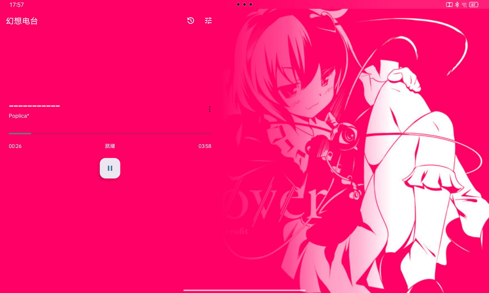

## Gensokyo Radio 3rd Eyes
[简体中文](README.zh_CN.md) | English

### Project Overview
Gensokyo Radio 3rd Eyes is a third-party open-source Android client for the [Gensokyo Radio](https://gensokyoradio.net), a Touhou Project fan music streaming service. Built with Google's recommended **AndroidX Media3** framework, this app supports Android 9.0+ and Android AutomotiveOS platforms.

### Key Features
- **Quality Switching**: Real-time 128kbps/320kbps bitrate selection
- **Custom Endpoints**: Configurable backup server addresses
- **Modern Architecture**: Powered by AndroidX Media3 ExoPlayer
- **Audio Visualization**: Real-time waveform visualizer
- **Play History**: Automatically tracks last 20 played tracks
- **Track Metadata**: Displays artist/album information in real-time
- **Auto Compatibility**: Full Android AutomotiveOS support
- **Active Development**: Lyrics sync, sleep timer in progress...

### Screenshots
| Mobile UI | Automotive UI |
|-----------|---------------|
|  |  |