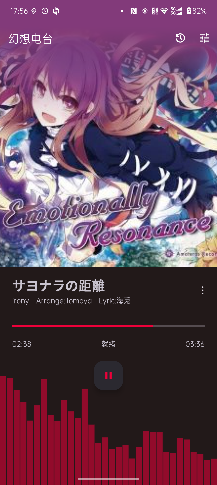

## 幻想电台 📻
简体中文 | [English](README.md)

### 项目概述
「幻想电台」是基于《东方Project》同人音乐电台[Gensokyo Radio](https://gensokyoradio.net)官方API开发的第三方开源Android客户端。本应用采用Google官方推荐的**AndroidX Media3**媒体框架构建，全面适配Android 9.0+系统，并支持Android AutomotiveOS车机平台。

### 核心功能
- **多音质切换**：支持128kbps/320kbps音频质量实时切换
- **自定义端点**：可配置备用服务器地址，保障稳定连接
- **现代架构**：基于AndroidX Media3 ExoPlayer的先进播放引擎
- **可视化体验**：实时音频波形可视化效果（Visualizer）
- **播放历史**：自动记录从应用打开时所播放的所有歌曲信息并本地存储
- **曲目信息**：实时显示当前播放的艺术家/专辑信息
- **车机适配**：完美兼容Android AutomotiveOS系统
- **持续更新**：歌词同步、睡眠定时器等新功能开发中...

### 界面预览
| 手机端界面                                                                                                    | 车机端界面 |
|----------------------------------------------------------------------------------------------------------|------------|
|  |  |